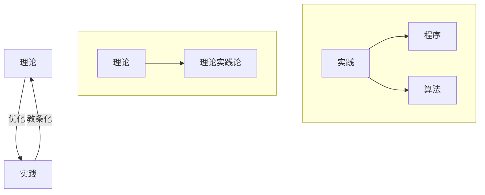

###  ###

### HTD ###

以下是个人对学习理论的构想：

!!! question
	- 如何将 理论/实践 划分子集？

!!! note "keys"
	- 心流，费曼，海马体，莫扎特效应

### 理论实践论 ###

理论实践论的基本思想是**收集能够解决实际问题的子问题的过程（称为 算法），以及将这些过程有效组合的方法（称为 程序）**

理论实践论是需要不断扩充和优化**算法集合**（但算法数量不宜过多），并将算法组合在一起的方法论；是让人们思考“做什么”的理论

!!! note "算法模块的概念"
	- 全局性异步算法：每种程序的公共部分，即每种程序都必须执行的异步算法，如：心流
		- 全局性异步算法是 算法集 和 程序集 的交集部分

如下我们将围绕 “如何提高学习效率” 进行分析

!!! note "$A_0$ 全局异步算法"
	1. 扩充当前问题/命题的其他算法

!!! note "$A_1$ 睡前回忆法则"
	1. 每天把不会的东西乱序写在纸上，晚上回忆（30min 起步）；如果想不起来 或 无法解决，那么带着问题睡觉
		1. 引理1：睡眠的首要功能是**加强记忆**
	2. 每个月遍历一遍当月的记录
		1. 引理2：每个知识点间隔性重复 6 次，基本不会遗忘
	3. 攻克难点 &弱点

!!! note "$A_2$ 心流"
	1. 明确学习目标，分解目标
	2. 保持安静的空间
	3. 开始之前清空大脑

!!! note "$A_3$ 听歌法则"
	1. 环境嘈杂 => 听歌学习
		1. 引理3：一些音乐具有可控性，能建立学习和环境之间的思维屏障
	2. 重复性工作 => 听喜欢的歌单
	3. 创造性工作 => 随机歌单
	4. 理科类工作 => 钢琴音，白噪声
	5. 语言类工作 => 无音

!!! note "$A_4$ 费马方法"
	1. 建立学习目标，以自己的语言组织知识
	2. 教授知识（如：将自己当老师，面对一群学生；或 写博客让人看懂）
		1. 引理4（费曼金字塔/费曼不等式）：对学习行为按照效率权重排序，有：$听讲(5\%) \le 阅读(10\%) \le 讨论 \le 笔记 \le 实践 \le 教授(90\%)$
		2. 引理5（教学的定义）：主动输入知识，处理知识，最后**主动输出知识**
	3. 教授知识的细节：
		1. 使用通俗语言描述；即，不使用定理/定律解释事物，而是使用公理来解释
		2. 类比描述
		3. 回顾：教授过程中遇到的认知障碍，则回到知识本身去回顾复习

